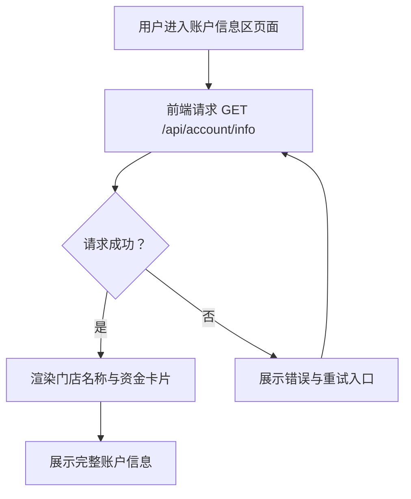

# 门店端收益提现对账 - 账户信息区 产品需求文档

## 1. 产品概述
本项目为门店端收益提现对账系统的「账户信息区」模块，面向门店经营者，提供账户核心资金数据的实时可视化展示。
- 核心目的：让门店经营者一目了然地掌握账户余额、可提现金额、冻结金额及累计营收等关键资金指标，支撑提现与对账决策。
- 目标用户：门店经营者 / 门店财务人员。

## 2. 核心功能

### 2.1 用户角色
| 角色 | 说明 | 核心权限 |
|------|------|----------|
| 门店经营者 | 系统主用户 | 查看账户信息、发起提现（本期仅展示） |

### 2.2 功能模块
1. **账户信息区页面**：门店名称展示、账户资金指标卡片（余额 / 可提现 / 冻结 / 累计营收）。

### 2.3 页面详情
| 页面名称 | 模块名称 | 功能描述 |
|----------|----------|----------|
| 账户信息区 | 门店名称栏 | 展示当前登录门店名称与门店编号 |
| 账户信息区 | 账户余额卡片 | 展示账户总余额，支持金额千分位格式化与币种符号 |
| 账户信息区 | 可提现金额卡片 | 展示当前可提现金额，作为主操作入口（高亮强调） |
| 账户信息区 | 冻结金额卡片 | 展示被冻结资金，辅以提示说明冻结原因 |
| 账户信息区 | 累计营收卡片 | 展示历史累计营收总额 |

## 3. 核心流程
用户进入账户信息区页面 → 前端发起获取账户信息请求 → 后端返回账户资金数据 → 前端渲染门店名称及四项资金指标卡片。

## 4. 用户界面设计

### 4.1 设计风格
- 主色调：深青绿（#0F766E）作为品牌信任色，辅以暖橙（#F59E0B）作为可提现金额的强调色
- 次要色：中性灰阶（zinc）用于背景与文字层级
- 按钮风格：圆角（rounded-xl），可提现金额卡片采用渐变填充与悬浮微交互
- 字体：标题使用思源黑体粗体，数字使用等宽字体以保证金额对齐
- 布局风格：卡片网格布局，顶部门店信息栏 + 下方四宫格资金指标
- 图标风格：线性图标（lucide），2px 描边

### 4.2 页面设计概览
| 页面名称 | 模块名称 | UI 元素 |
|----------|----------|---------|
| 账户信息区 | 门店名称栏 | 门店图标 + 名称 + 编号标签，左对齐布局，底部细分隔线 |
| 账户信息区 | 余额卡片 | 卡片容器、标签、大号金额数字、币种符号 |
| 账户信息区 | 可提现卡片 | 渐变背景、强调金额、提现按钮提示、悬浮上浮阴影 |
| 账户信息区 | 冻结金额卡片 | 中性灰底、金额、冻结原因 tooltip 提示 |
| 账户信息区 | 累计营收卡片 | 上升趋势图标、金额、辅助说明文案 |

### 4.3 响应式
- 桌面优先：四宫格一行排列
- 平板：两两一行
- 移动端：单列纵向堆叠，保持金额可读性

## 5. 数据字段定义
| 字段 | 类型 | 说明 |
|------|------|------|
| storeName | string | 门店名称 |
| storeNo | string | 门店编号 |
| accountBalance | number | 账户余额（分） |
| availableAmount | number | 可提现金额（分） |
| frozenAmount | number | 冻结金额（分） |
| totalRevenue | number | 累计营收（分） |
| frozenReason | string | 冻结原因说明 |
