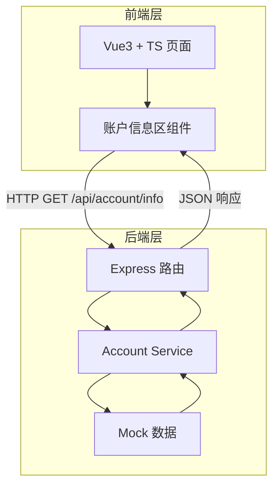
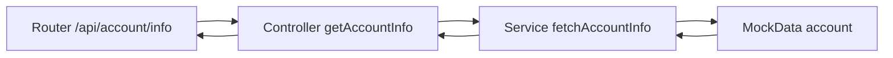

# 门店端收益提现对账 - 账户信息区 技术架构文档

## 1. 架构设计


## 2. 技术说明
- 前端：Vue@3 + TypeScript + Vite + Tailwind CSS + vue-router
- 初始化工具：vite-init（vue-express-ts 模板）
- 后端：Express@4 + TypeScript（ESM）
- 数据：Mock 数据（前端可通过 API 获取），金额单位为「分」，前端展示时换算为「元」

## 3. 路由定义
| 路由 | 用途 |
|------|------|
| / | 账户信息区主页面 |

## 4. API 定义

### 4.1 获取账户信息
- 路径：`GET /api/account/info`
- 请求参数：无
- 响应：
```typescript
interface AccountInfo {
  code: number;        // 0 表示成功
  message: string;
  data: {
    storeName: string;        // 门店名称
    storeNo: string;          // 门店编号
    accountBalance: number;   // 账户余额（分）
    availableAmount: number;  // 可提现金额（分）
    frozenAmount: number;     // 冻结金额（分）
    totalRevenue: number;     // 累计营收（分）
    frozenReason: string;     // 冻结原因
  }
}
```

## 5. 服务端架构图


## 6. 数据模型
本项目当前使用 Mock 数据，无需持久化数据库。Mock 数据结构如下：

### 6.1 数据定义
```typescript
const accountInfo = {
  storeName: "南京新街口旗舰店",
  storeNo: "NJ-00128",
  accountBalance: 1286750,   // 12867.50 元
  availableAmount: 982300,   // 9823.00 元
  frozenAmount: 304450,      // 3044.50 元
  totalRevenue: 56982100,    // 569821.00 元
  frozenReason: "存在进行中的提现申请，对应金额暂时冻结"
}
```

## 7. 目录结构
```
017-门店端收益提现对账/
├── src/                      # 前端代码
│   ├── components/
│   │   └── AccountInfoArea.vue   # 账户信息区组件
│   ├── composables/
│   │   └── useAccountInfo.ts     # 账户信息请求逻辑
│   ├── utils/
│   │   └── format.ts             # 金额格式化工具
│   ├── views/
│   │   └── Home.vue
│   ├── App.vue
│   ├── main.ts
│   └── style.css
├── api/                      # 后端代码
│   ├── routes/
│   │   └── account.ts
│   ├── services/
│   │   └── accountService.ts
│   ├── data/
│   │   └── mockAccount.ts
│   └── server.ts
└── shared/                   # 前后端共享类型
    └── types.ts
```
